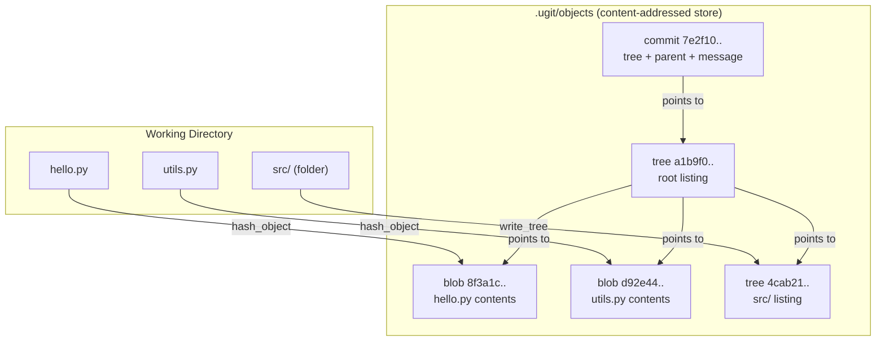
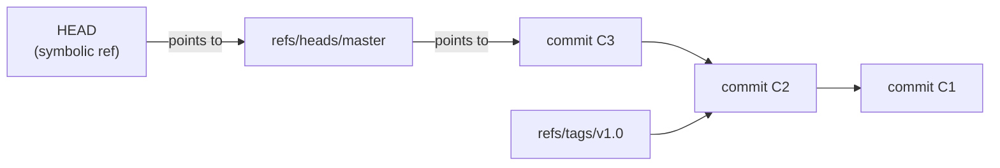
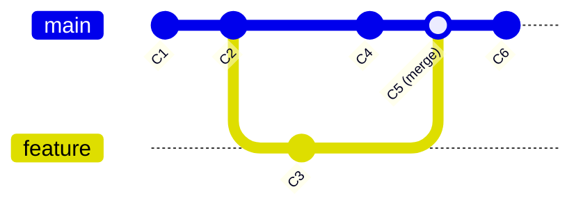
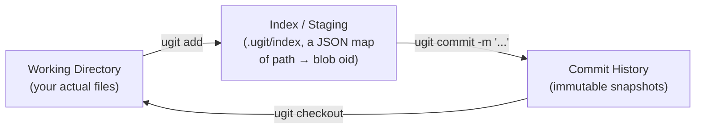

# ugit 🪶

A tiny version control system, built from scratch in Python to understand what Git is *actually* doing under the hood.

`ugit` isn't trying to replace Git — it's trying to demystify it. Every command you already know (`add`, `commit`, `branch`, `merge`, `push`...) is reimplemented here in plain, readable Python, using the exact same core ideas as real Git: content-addressed objects, trees, commits as a DAG, and refs that just point at things.

If you've ever wondered *"wait, what does Git actually store on disk?"* — this project (and this README) will walk you through it.

---

## Why this exists

Git feels like magic until you realize it's really just three ideas stacked on top of each other:

1. **Content-addressable storage** — every file, folder, and commit is stored as an object, named by the hash of its own contents.
2. **A tree of trees** — directories are just objects that point to other objects.
3. **A linked list of snapshots** — a commit is a tree plus a pointer to its parent commit(s).

That's it. Branches, tags, merges, even `push`/`fetch` — they're all built on top of that same foundation. `ugit` implements each layer one piece at a time, so you can actually read the source and see how it fits together.

---

## How data is stored — the object model

Everything in `ugit` lives inside a `.ugit` folder, and almost everything inside it is an **object**: a blob of bytes saved under the SHA-1 hash of its own content (type + contents). This is identical to how real Git stores things.



There are exactly three kinds of objects:

| Object | What it holds | Real-world analogy |
|---|---|---|
| **blob** | The raw bytes of a single file | A snapshot of one file's contents |
| **tree** | A list of `(type, oid, name)` entries — basically a folder listing | A directory |
| **commit** | A tree oid, zero or more parent oids, and a message | A snapshot in time, with history attached |

Because objects are named by their hash, two files with identical content are stored *once* — that's the whole trick behind Git being so storage-efficient.

---

## Refs: how `ugit` knows where "here" is

Objects on their own are just an enormous, nameless pile of snapshots. **Refs** are what give them human-readable meaning — `HEAD`, branch names, tags. A ref is nothing more than a small text file that contains either an object id, or a pointer to another ref (a "symbolic ref").



This is why `git checkout <branch>` feels different from `git checkout <commit-hash>`: checking out a branch moves `HEAD` to a *symbolic* ref that follows the branch as it advances, while checking out a raw commit hash detaches `HEAD` and points it directly at that one snapshot.

---

## The commit graph

A commit only ever knows about its *parent(s)* — it has no idea what comes after it. String enough commits together and you get the structure everyone recognizes as "git log":



A merge commit is special only in that it has **two** parents instead of one — that's the entire trick behind branching and merging. Walking "backwards" from any commit, following parent pointers, is how `log`, `merge-base`, and `fetch` figure out commit history.

---

## The lifecycle of a change

This is the part that trips people up the most: the difference between your **working directory**, the **index** (staging area), and the **commit history**. `ugit` keeps these three completely separate, exactly like Git does.



* **Working directory** — the files you're actually editing.
* **Index** — a snapshot of what *will* go into the next commit. It's literally just a JSON file mapping `path → blob oid`.
* **History** — a permanent, append-only chain of commits. Nothing here ever gets rewritten; `reset` and `checkout` just move pointers around.

`ugit status` and `ugit diff` exist precisely to compare these three layers against each other and tell you what's different.

---

## Project layout

```
ugit/
├── cli.py      → the command-line interface: parses args, calls into base.py
├── base.py     → the "porcelain" layer: commits, branches, merge, checkout, status
├── data.py     → the "plumbing" layer: objects, refs, the index, raw disk I/O
├── diff.py     → tree/blob diffing and 3-way merging (shells out to diff/diff3)
└── remote.py   → fetch/push between two ugit repos (just copies objects + refs)
```

This mirrors how real Git is organized: **plumbing** (low-level, mechanical) vs. **porcelain** (the friendly commands you actually type).

---

## Installation

You'll need Python 3 and the `diff`/`diff3` command-line tools (already on virtually every Linux/macOS box; on Windows, WSL or Git Bash works fine).

```bash
git clone <this-repo>
cd custom_git
pip install -e .
```

That last command registers a `ugit` executable on your PATH using the `setup.py` entry point, so from here on you just type `ugit ...` from any directory.

---

## Command reference

Below is every command `ugit` understands, what it actually does internally, and when you'd reach for it.

### `ugit init`

```bash
ugit init
```

Creates a `.ugit` folder in the current directory with an empty `objects` store, and points `HEAD` at `refs/heads/master`. This is the very first thing you run in any new project — it's the equivalent of `git init`.

### `ugit add <file-or-folder>...`

```bash
ugit add hello.py
ugit add src/
ugit add .
```

Hashes the given file(s) — recursing into directories — and records their object ids in the index. Nothing is committed yet; this only *stages* the change. You can pass as many files or folders as you like in one call.

### `ugit commit -m "<message>"`

```bash
ugit commit -m "Add login form validation"
```

Takes whatever is currently staged in the index, turns it into a tree object, wraps that tree in a commit object (along with the current `HEAD` as the parent), and moves `HEAD` to point at the new commit. Prints the new commit's hash.

### `ugit status`

```bash
ugit status
```

Tells you which branch you're on (or if `HEAD` is detached), and shows two separate diffs: what's staged but not yet committed, and what's changed in your working directory but not yet staged. This is your "what's going on right now" command.

### `ugit log [<commit>]`

```bash
ugit log
ugit log my-feature
```

Walks backward from a commit (defaults to the current `HEAD`, written as `@`) through every parent, printing each commit's hash, message, and any branch/tag names pointing at it.

### `ugit show [<commit>]`

```bash
ugit show
ugit show a1b2c3d4e5
```

Prints a single commit's metadata plus a unified diff against its parent — basically "what changed in this one commit?"

### `ugit diff [--cached] [<commit>]`

```bash
ugit diff                 # working dir vs. index
ugit diff --cached        # index vs. HEAD
ugit diff some-branch     # working dir vs. an arbitrary commit
```

Shows line-by-line differences between any two of: a commit, the index, and the working directory. Without flags it shows your unstaged edits; `--cached` shows what you're about to commit.

### `ugit branch [<name>] [<start-point>]`

```bash
ugit branch                  # list all branches, * marks the current one
ugit branch my-feature       # create a new branch at HEAD
ugit branch hotfix some-tag  # create a branch starting elsewhere
```

A branch is nothing more than a ref under `refs/heads/` pointing at a commit. Creating one is cheap — it's just writing a small text file.

### `ugit checkout <branch-or-commit>`

```bash
ugit checkout my-feature
ugit checkout a1b2c3d4e5
```

Replaces the contents of your working directory with whatever a given commit's tree contains, and moves `HEAD` there. Checking out a branch name keeps `HEAD` "attached" (it'll follow new commits on that branch); checking out a raw hash detaches it.

### `ugit tag <name> [<commit>]`

```bash
ugit tag v1.0
ugit tag release-candidate a1b2c3d4e5
```

Creates a permanent, named pointer at a specific commit. Unlike branches, tags don't move — they're a fixed bookmark, perfect for marking releases.

### `ugit merge <commit-or-branch>`

```bash
ugit merge my-feature
```

Merges another branch into your current one. If your current branch hasn't diverged at all (a simple "fast-forward"), it just moves the pointer forward. Otherwise it finds the common ancestor, runs a proper three-way merge (via `diff3`) on every file, and leaves the result staged in your working directory for you to review and commit.

### `ugit merge-base <commit1> <commit2>`

```bash
ugit merge-base main my-feature
```

Finds the most recent commit that both branches share — the same logic the `merge` command uses internally to figure out what's actually changed on each side.

### `ugit reset <commit>`

```bash
ugit reset a1b2c3d4e5
```

Moves `HEAD` directly to a given commit, without touching your working directory or staged files. Handy for "undoing" the last commit while keeping your changes.

### `ugit hash-object <file>` / `ugit cat-file <oid>`

```bash
ugit hash-object notes.txt
ugit cat-file 8f3a1c9b...
```

The lowest-level plumbing commands. `hash-object` stores a single file as a blob and prints its hash; `cat-file` does the reverse — given a hash, it prints the raw object content back out. Great for poking around `.ugit/objects` and seeing the storage model with your own eyes.

### `ugit write-tree` / `ugit read-tree <tree-oid>`

```bash
ugit write-tree
ugit read-tree 4cab21f0...
```

`write-tree` snapshots whatever's currently in the index into a tree object and prints its hash. `read-tree` does the opposite: given a tree hash, it loads that snapshot back into the index. These are what `commit` and `checkout` use behind the scenes.

### `ugit k`

```bash
ugit k
```

A little visualization command — walks every ref and every commit reachable from it, and renders the whole commit graph to `graph.svg` using Graphviz (`dot` needs to be installed separately for this one). Genuinely useful for *seeing* the DAG instead of just reading commit messages.

### `ugit fetch <remote-path>`

```bash
ugit fetch ../teammates-copy
```

Copies any objects from a remote `ugit` repository (just a path to another `.ugit` folder — could be a shared drive, a network mount, anything) that you don't already have locally, and records their branches under `refs/remote/`. No network protocol involved — it's literally a file copy.

### `ugit push <remote-path> <branch>`

```bash
ugit push ../teammates-copy master
```

The reverse of `fetch`: copies your local objects that the remote is missing, then updates the remote's branch ref to match yours. `ugit` refuses to push if doing so wouldn't be a fast-forward on the remote side, to avoid silently overwriting someone else's work.

---

## A worked example, start to finish

```bash
mkdir demo && cd demo
ugit init

echo "print('hello world')" > app.py
ugit add app.py
ugit commit -m "Initial commit"

ugit branch feature-x
ugit checkout feature-x

echo "print('a new feature')" >> app.py
ugit add app.py
ugit commit -m "Add new feature"

ugit checkout master
ugit merge feature-x
ugit commit -m "Merge feature-x into master"

ugit log
ugit k          # generates graph.svg — open it to see the DAG visually
```

Walking through `.ugit/objects` afterwards, you'll find a small handful of blob, tree, and commit objects — and if you trace the hashes by hand with `cat-file`, you can literally watch your project's entire history unfold from nothing but hashed text files.

---

## What's deliberately left out

This is a learning project, not a Git replacement, so a few things are intentionally simplified or skipped: no packfiles or delta compression (every object is stored in full), no real network transport for `fetch`/`push` (remotes are just local/mounted paths), no `.gitignore`-style configurable ignore rules (only `.ugit` itself is ignored), and no conflict markers UI beyond what `diff3` produces directly in the file.

If you want to go further, those are exactly the right next rabbit holes to fall into.

---

## Credit

Built as a deep-dive into Git internals — the goal throughout was readability over performance, so don't be afraid to just open up `base.py` and read it top to bottom.
